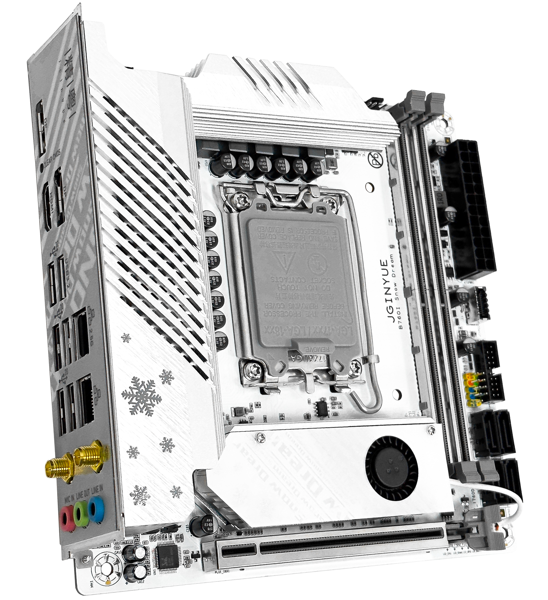

# Hackintosh 精粤JGINYUE B760i SnowDream

 

## 硬件 / Hardware
| 项目 | 内容 | 备注 |
| ----- | ----- |-----|
| 处理器 / CPU | Intel i5-13490F ( 6C+4c - 16T ) | 13代核显无法驱动 |
| 主板 / MB | JGINYUE B760i Snow Dream | 内存为DDR4 |
| 内存 / RAM | Gloway 光威天策 8*2 GB DDR4 3200 Mhz | 便宜又好用 |
| 显卡 / DGPU | AMD Radeon RX 5700 公版 | 免驱 |
| 有线网络1 / Lan1 | Realtek RTL8111H | 千兆网络 |
| 有线网络2 / Lan2 | Realtek RTL8125B | 2.5G网络 |
| 无线 + 蓝牙 : Wifi + Bluetooth | 博通 BCM94352Z (Fenvi版本) | 免驱 |
| 音频 / Audio | Realtek ALC897 |  |
| 固态硬盘 / NVMe | 西部数据 WD SN850 1TB / WD SN750 1T |  |
| 处理器散热 / CPU Fan | 利民 AXP90-X47 白色 |  |
| 电源 / Power | 全汉FSP-MS450 450瓦 全模组 |  |
| 机箱 / Case | 定制款A4机箱 |  |
 

## 软件 / Software
| 项目 | 内容 | 备注 |
| ----- | ----- | ----- |
| SMBIOS | MacPro7,1 | 也可替换 iMacPro1,1 |
| BootLoader | OpenCore 0.9.4 | 最新 |
| macOS | Monterey | 虽然13，14也可以，但是12支持更多 |
 

## 工作情况 / Fuctional
### 视频 / Display
|| 项目 | 内容 | 备注 |
|-----| ----- | ----- | ----- |
|✅| 核显 | UHD770 | 13代无法驱动 |
|✅| 独立显卡 | RX5700 | 为防止黑屏，启动项需添加 `agdpmod=pikera` |
 

### 音频 / Audio
|| 项目 | 内容 | 备注 |
|-----| ----- | ----- | ----- |
|✅| 音频 | ALC897 | 使用 `AppleALC.kext` 可驱动，对应ID为66； |
 

### 电源管理、睡眠、休眠 / Power, Sleep and Hibernation
✅ 电源管理使用 `SSDT-PLUG-ALT` 即可解决；

✅ 睿频问题使用 `CPUFriend` 和 `CPUFriendDataProvider` 搭配即可；

⚠️ 关于睡眠和休眠：本人没有配置；因为本人台式机用不到。
 

### 无线和蓝牙 / WiFi + Bluetooth
|| 项目 | 内容 | 备注 |
|-----| ----- | ----- | ----- |
|✅| 无线 | 博通BCM94352Z | 建议购买Fenvi版本，可直插直用 |
|✅| 蓝牙 | 博通BCM94352Z | 建议购买Fenvi版本，可直插直用 |
 

### USB端口 / USB Port
|| 项目 | 内容 | 
|-----| ----- | ----- | 
|✅| XhciPortLimit方法 | OpenCore升级到0.9.3版本之后，可以直接使用 XhciPortLimit 解除USB限制； |
|✅| USB定制方法 | 使用工具重新定制端口即可； |

 

## BIOS 相关
|| 项目 | 内容 | 
|-----| ----- | ----- | 
|❌| 关闭 | Resizable BAR | 
|❌| 关闭 | Fast Boot 快速启动 | 
|❌| 关闭 | VT-d | 
|❌| 关闭 | CSM | 
|❌| 关闭 | Intel SGX | 

|| 项目 | 内容 | 
|-----| ----- | ----- | 
|✅| 开启 | VT-X |
|✅| 开启 | Above 4G decoding |
|✅| 开启 | Hyper-Threading |
|✅| 开启 | EHCI/XHCI Hand-off |
|✅| 开启 | OS type: Windows UEFI Mode (或者清除所有 Secure Boot Keys 然后选 `Other` ) |
|✅| 开启 | DVMT Pre-Allocated(iGPU Memory): 64MB |
 

## Refrence / 必读参考资料

- [dortania's OpenCore Install Guide](https://dortania.github.io/OpenCore-Install-Guide/)
- [dortania's OpenCore Post Install Guide](https://dortania.github.io/OpenCore-Post-Install/)
- [dortania Getting Started with ACPI](https://dortania.github.io/OpenCore-Post-Install/)
- [dortania opencore multiboot](https://github.com/dortania/OpenCore-Multiboot)
- [WhateverGreen Intel HD Manual](https://github.com/acidanthera/WhateverGreen/blob/master/Manual/FAQ.IntelHD.en.md)
- `Configuration.pdf` and `Differences.pdf` in each OpenCore releases.
- [daliansky/OC-little](https://github.com/daliansky/OC-little)
- [OpenCore 简体中文参考手册 (非官方)](https://oc.skk.moe)

**务必阅读上述参考资料**
